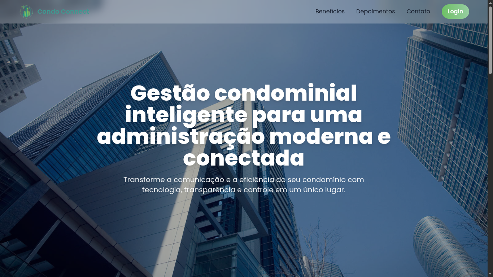

# Condo Connect — Front-End

Interface web moderna e responsiva para o sistema **Condo Connect**, plataforma de gestão condominial.  
Desenvolvido com foco em **clareza, usabilidade e performance**, este repositório contém apenas o **front-end** do projeto.

---

## 🖼️ Preview da Landing Page



---

## 🚀 Visão Geral

O **Condo Connect** facilita a administração de condomínios e a comunicação entre síndicos, moradores e prestadores de serviço.  
Este módulo front-end oferece uma base sólida de interface, com componentes reutilizáveis e design responsivo, pronto para integração futura com o back-end.

---

## 🧩 Tecnologias

- **HTML5** — Estrutura semântica e otimizada.  
- **CSS3 / TailwindCSS** — Estilização modular e responsiva.  
- **JavaScript** — Lógica de interação e controle dinâmico da interface.

---

## 📂 Estrutura do Projeto

```bash
.
├── src/
│   └── css/
│   └── img/
│   └── js/
├── index.html
├── login_dash.html
└── README.md
```

## ⚙️ Como Executar

1. Clone o repositório:

   ```bash
   git clone https://github.com/Ivysonin/Condo_Connect.git
   ```
2. Acesse a pasta do projeto:

   ```bash
   cd Condo_Connect
   ```
3. Abra o arquivo principal:

   ```bash
   index.html
   ```
4. Visualize no navegador.
   (Recomendado: **Live Preview** do VSCode)

---

## 📄 Licença

Este projeto está licenciado sob os termos da [Licença MIT](./LICENSE), com cláusula adicional de atribuição.

---

## 👥 Equipe  

| Membro | Função | Perfis |
|:--|:--|:--|
| **Ivyson Thauan** | Gerente | [GitHub](https://github.com/ivysonin) |
| **Bárbara Siqueira** | Analista de Dados | [GitHub](https://github.com/barbaraspa) |
| **José Pedro** | Designer | [GitHub](https://github.com/zepreda) |
| **Paulo Henrique** | Dev Full-Stack | [GitHub](https://github.com/Henrique8350) |
